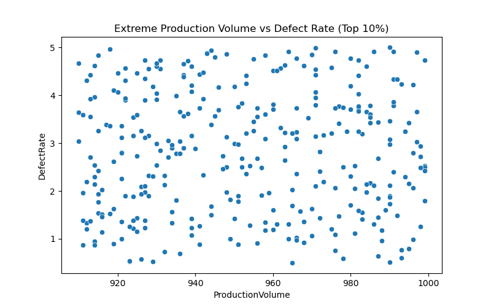

# 🏭 Manufacturing Defects Analysis

This repository contains a **comprehensive exploratory analysis** of a synthetic manufacturing dataset, focusing on factors affecting defect rates across production, supply chain, maintenance, workforce, energy efficiency, and additive manufacturing.

All analysis and visualizations were performed using **Python (pandas, seaborn, matplotlib)**.  

All plots are saved in the `plots` folder and displayed below for quick reference.

---

## 📊 Dataset Overview

The dataset includes key metrics related to:

- Production efficiency (`ProductionVolume`, `ProductionCost`)  
- Supplier quality (`SupplierQuality`, `DeliveryDelay`)  
- Quality control (`DefectRate`, `QualityScore`)  
- Maintenance (`MaintenanceHours`, `DowntimePercentage`)  
- Inventory (`InventoryTurnover`, `StockoutRate`)  
- Workforce (`WorkerProductivity`, `SafetyIncidents`)  
- Energy (`EnergyConsumption`, `EnergyEfficiency`)  
- Additive manufacturing (`AdditiveProcessTime`, `AdditiveMaterialCost`)  

The target variable is `DefectStatus`:

- **0 → Low Defects**  
- **1 → High Defects**  

---

## 🖼️ Visual Analysis

### 1. Avg Defect Rate by Energy Efficiency Quartile
  
- Observation: Defect rate ~2.7 across all quartiles.

### 2. Percentage of High Defect Batches
  
- High Defect: 84%  
- Low Defect: 16%  
- Observation: Majority of batches are high-defect.

### 3. Extreme Production Volume vs Defect Rate
  
- Observation: Wide scatter; defect rates vary independently of production volume.

### 4. Low Supplier Quality vs Defect Rate
  
- Observation: Lower supplier quality shows higher variability in defect rates.

### 5. Defect Rate by Maintenance Level
  
- Observation: Defect rate nearly constant (~2.7) across maintenance levels.

### 6. Avg Defect Rate by Production Cost Range
  
- Observation: Production cost has minimal effect on defect rate.

### 7. Top 20 Defect-Prone Batches
  
- Observation: Defect rates around ~5%, slight variation.

### 8. Additive Material Cost vs Process Time vs Defect Rate
  
- Observation: No clear pattern; defect rate scattered.

### 9. Energy Efficiency vs Energy Consumption
  
- Observation: Defect rate not clearly linked to energy consumption.

### 10. Safety Incidents vs High Defect Batches
  
- Observation: Slight increase in high defects with more safety incidents.

### 11. Avg Defect Rate by Worker Productivity
  
- Observation: No clear trend; defect rates remain mixed.

### 12. Inventory Turnover vs Stockout Rate
  
- Observation: High turnover does not guarantee low stockout risk.

### 13. Maintenance Hours vs Downtime %
  
- Observation: High scatter; no clear linear pattern.

### 14. High Defect Batches vs Delivery Delay
  
- Observation: No simple linear relationship.

### 15. Avg Defect Rate by Supplier Quality
  
- Observation: Scatter across quality levels; no strong correlation.

### 16. Top 10 Production Volumes vs Defect Rate
  
- Observation: Defect rates range ~2–4%; no linear trend.

---

## 🔧 Technical Details

- **Python Libraries:** pandas, matplotlib, seaborn, os  
- **Folder Structure:**
```
manufacturing-defects-analysis/
│
├── manufacturing_dataset.csv # Input dataset
├── queries.sql # queries 
├── plots/ # All generated plots
├── analysis.py # Python code
└── README.md # Project documentation
```

- **Usage:**  
```bash
python analysis.py
All plots are automatically saved in the plots folder.
```

---

## 📌 Observations & Insights
- High variability in defect rates across most factors.
- Energy efficiency, maintenance, and production cost show minimal effect on defect rate in this dataset.
- Majority of batches are high-defect (~84%).
- Scatter plots suggest no clear linear relationships; deeper statistical or ML analysis may reveal hidden patterns.

---

## ⚠️ Notes
- Dataset is synthetic for educational purposes.
- Analysis focuses on exploratory data visualization, not causal inference.
- Further steps could include predictive modeling to estimate DefectStatus.

---

**Author:** Mohamed Emad Alhadi | Data Analyst    
